# PRD Global — PIXPAY (pixpay.awecloudsolution.com)

**Status:** Aprovado / Baseline de Produto  
**Data:** 2026-09-20  
**Versão:** 1.0.0  
**Referência Mestre:** [PIXPAY_DOCUMENTO_MESTRE.md](PIXPAY_DOCUMENTO_MESTRE.md)  
**Brainstorm de Origem:** [brainstorm-pixpay.md](brainstorm-pixpay.md)  

---

## 1. Visão do Produto e Objetivos Estratégicos

O **PIXPAY** é uma plataforma multi-tenant de cobrança e recebimento via PIX desenhada para oferecer atrito zero na criação e acompanhamento de pagamentos instantâneos. Atuando como uma camada de aplicação inteligente, o PIXPAY abstrai os contratos técnicos e a complexidade dos provedores de serviços de pagamento (iniciando pela LofyPay) e conecta o ecossistema a duas interfaces primárias:
1. **Painel Web Operacional:** Uma interface minimalista focada na tarefa essencial (`Entrar → Informar valor → Gerar PIX → Acompanhar recebimento`).
2. **Hermes Agent (IA Conversacional):** Acesso natural via WhatsApp através do protocolo MCP (Model Context Protocol), viabilizando criação e checagem de cobranças em linguagem humana.

### Princípio Central de Privacidade
O PIXPAY resguarda dados de contato e evita a exposição pública desnecessária de chaves bancárias pessoais, mas **não promete nem comercializa anonimato financeiro**. Todas as transações ocorrem dentro da estrita legalidade e rastreabilidade exigidas pelo Banco Central do Brasil e pelos PSPs integrados.

---

## 2. Personas e Casos de Uso

| Persona | Papel | Principais Ações |
|---|---|---|
| **Sócio / Owner** | Administrador do Tenant | Cadastra credenciais LofyPay (Sandbox/Produção), gerencia usuários, acompanha volume recebido. |
| **Operador / Financeiro** | Usuário Operacional | Gera cobranças pelo painel ou pelo WhatsApp, checa status de pagamentos, exporta históricos. |
| **Cliente / Pagador** | Usuário Externo | Lê o QR Code dinâmico ou utiliza o código PIX Copia e Cola para liquidar a fatura. |
| **Hermes Agent** | Agente de IA (WhatsApp) | Cria cobranças e responde a consultas de status e resumos financeiros sob autorização do backend. |

---

## 3. Delimitação do Escopo do MVP

### O que está no MVP
- Autenticação e isolamento multi-tenant estrito (`tenant_id`).
- Gestão de credenciais da LofyPay com criptografia em repouso (AES-256-GCM).
- Geração de cobranças PIX dinâmicas com QR Code e código Copia e Cola.
- Ingestão assíncrona de Webhooks da LofyPay com persistência de payload bruto e filas BullMQ.
- Histórico imutável de eventos de pagamento (`payment_events`) e trilha de auditoria (`audit_logs`).
- Servidor MCP integrado para o Hermes Agent com ferramentas de baixo risco (`pix_create`, `pix_get`, `pix_list`, `pix_summary`).
- Painel Web em Next.js com dashboard diário e fluxo ultra-rápido de emissão.
- Notificação de pagamento confirmado disparada para o Hermes Agent.

### O que está explicitamente FORA do MVP
- **Cashout / Transferências de Saída:** Nenhuma ferramenta de envio de dinheiro ou saque automatizado estará disponível no MVP.
- **Divisão de Pagamento (Split):** Será avaliado comercialmente e tecnicamente em fases futuras.
- **Páginas Públicas de Perfil (`/{username}`):** Reservadas para a Fase 6.
- **Onboarding Aberto ao Público:** Apenas os 3 sócios e contas convidadas manualmente no primeiro momento.

---

## 4. Roadmap de Desenvolvimento

```mermaid
flowchart LR
    F0["Fase 0: Fundação & CI/CD"] --> F1["Fase 1: Multi-tenant & Auth"]
    F1 --> F2["Fase 2: Provider Core & LofyPay"]
    F2 --> F3["Fase 3: Payments & Webhooks"]
    F3 --> F4["Fase 4: Hermes MCP Server"]
    F4 --> F5["Fase 5: WhatsApp Notifier"]
    F5 --> F6["Fase 6: Página Pública"]
    F6 --> F7["Fase 7: Automação & IA Avançada"]
    F7 --> F8["Fase 8: Expansão & Split"]
```

### Detalhamento das Fases

- **Fase 0 — Fundação & Infraestrutura (Sprint 1):**
  - Repositório, monorepo, padrões de engenharia e baseline Wittemberg.
  - Configuração do Docker Swarm, Traefik v3 (`letsencryptresolver`), PostgreSQL 18 e Redis 7.
  - Pipeline GitHub Actions com publicação de imagens no `ghcr.io` e trigger de stack webhook no Portainer.
- **Fase 1 — Multi-tenant & Identidade (Sprint 2):**
  - Modelos `User`, `Tenant`, `TenantUser` com papéis `OWNER`, `ADMIN`, `VIEWER`.
  - Autenticação JWT e emissão de Service Accounts com tokens `wpk_live_...`.
  - Trilha de auditoria (`audit_logs`) para operações sensíveis.
- **Fase 2 — LofyPay & PaymentProvider (Sprint 3):**
  - Contrato abstrato `PaymentProvider`.
  - Implementação do adapter `LofyPayProvider` (validação de credenciais, geração de PIX e consulta).
  - Criptografia AES-256-GCM para chaves de API financeiras.
- **Fase 3 — Ciclo de Vida de Pagamentos & Webhooks (Sprint 4):**
  - Entidade `Payment` com estados canônicos (`CREATED`, `PENDING`, `PAID`, `EXPIRED`, `CANCELLED`, `FAILED`).
  - Ingestão de Webhooks da LofyPay com persistência de payload bruto em `webhook_events`.
  - Processamento assíncrono via BullMQ Worker e rotina periódica de reconciliação de pendentes.
- **Fase 4 — Interface MCP para Hermes Agent (Sprint 5):**
  - Servidor MCP expondo `pix_create`, `pix_get`, `pix_list`, `pix_summary`.
  - Validação estrita de escopos por Service Account; auditoria de cada chamada.
- **Fase 5 — Painel Web & Notificações WhatsApp (Sprint 6):**
  - Frontend Next.js minimalista (Dashboard, Gerar PIX, Histórico, Configurações LofyPay).
  - Envio de evento `payment.paid` para o Hermes Agent notificar o sócio no WhatsApp.
- **Fases 6 a 8 — Expansão Futura:**
  - Página pública de recebimento (`pixpay.awecloudsolution.com/{username}`).
  - Lembretes automáticos, relatórios financeiros em linguagem natural e novos provedores.

---

## 5. Critérios de Sucesso e Aceite do MVP

1. **Isolamento Completo:** Sob nenhum teste de carga ou injeção de parâmetros o Tenant A acessa ou deduz pagamentos ou credenciais do Tenant B.
2. **Resiliência de Webhook:** A ingestão de webhook responde HTTP 200/202 em menos de 200ms; duplicações da LofyPay não alteram balanços ou duplicam eventos.
3. **Experiência Conversacional:** A mensagem `"Gera um PIX de 350 pro João"` enviada ao Hermes retorna o Copia e Cola e imagem do QR Code em menos de 3 segundos.
4. **Segurança de Credenciais:** Nenhuma Secret Key da LofyPay é registrada em logs, trafegada em texto plano ou exposta ao Hermes Agent.
5. **Observabilidade:** Todas as operações geram logs estruturados em JSON com `request_id`, `tenant_id` e identificador de auditoria.

---

## 6. PRDs de Features Vinculados

Os requisitos detalhados de cada subsistema estão especificados nos seguintes PRDs em [docs/prds/](prds/):
- [PRD-001: Multi-tenant, Identidade e Autorização](prds/001-multi-tenant-auth.md)
- [PRD-002: Núcleo de Pagamentos PIX & Provider LofyPay](prds/002-pagamentos-pix-core.md)
- [PRD-003: Ingestão de Webhooks, Filas e Reconciliação](prds/003-webhooks-reconciliacao.md)
- [PRD-004: Servidor MCP para Hermes Agent (WhatsApp)](prds/004-hermes-mcp.md)
- [PRD-005: Painel Web Minimalista & Dashboard](prds/005-painel-web-dashboard.md)
