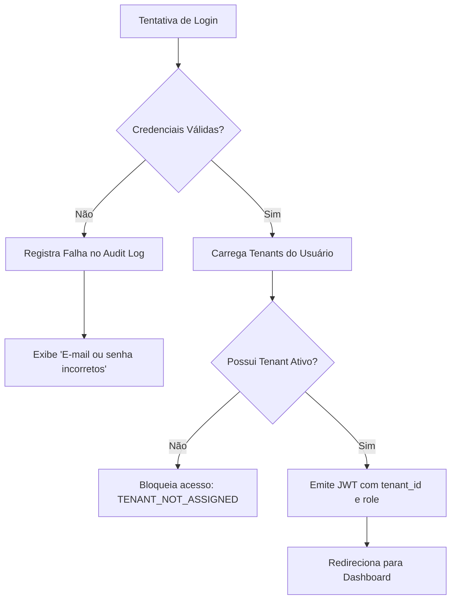

# PRD 001: Multi-tenant, Identidade e Autorização

## 1. Contexto

- **Produto/área:** Núcleo de Identidade, Autenticação e Multi-tenancy do PIXPAY.
- **Estado atual:** Projeto inicial; não existe cadastro de usuários nem segregação de organizações.
- **Problema:** Múltiplos sócios e clientes usarão a mesma plataforma. É imperativo que os dados financeiros, histórico e chaves de API da LofyPay de um tenant sejam completamente inacessíveis por outros. Além disso, agentes autônomos (Hermes Agent) necessitam de credenciais de máquina (Service Accounts) seguras e auditadas.

> **Contexto técnico:** Detalhes de schema PostgreSQL, hashes bcrypt/argon2 e tokens JWT vivem no TRD (`docs/trd.md`) e no ADR-003.

## 2. Solução Proposta

### Visão de produto
- Autenticação de usuários via e-mail e senha com suporte a sessão segura.
- Modelo de organização (Tenant) onde um usuário pode pertencer a um ou mais tenants com papéis específicos (`OWNER`, `ADMIN`, `VIEWER`).
- Criação de Service Accounts para bots (Hermes Agent) emitindo tokens com prefixo `wpk_live_...`.
- Auditoria de segurança de todas as tentativas de login e mudanças de privilégios.

### Decisões de produto
1. Um usuário no MVP possui um tenant padrão atribuído no momento do cadastro.
2. Papel `VIEWER` tem acesso estritamente somente-leitura; não pode gerar PIX nem cadastrar credenciais.
3. Papel `ADMIN` pode gerar PIX e gerenciar pagamentos, mas não pode alterar as credenciais financeiras da LofyPay nem criar outros administradores.
4. Papel `OWNER` possui controle total sobre o tenant, incluindo a conexão com a LofyPay e rotação de tokens.

### Fora do escopo
- Single Sign-On (SSO) com Google ou Microsoft (fora do MVP).
- Autenticação em dois fatores (2FA/MFA) por SMS ou TOTP (planejado para Fase 7).
- Cadastro público aberto (onboarding inicial é por convite/admin).

## 3. Funcionalidades

### US01: Autenticação de Usuário e Seleção de Tenant
Como sócio do PIXPAY, quero me autenticar com e-mail e senha, para acessar o painel de cobranças do meu tenant.

**Rules:**
- Credenciais inválidas devem retornar erro genérico "E-mail ou senha incorretos" sem revelar a existência do e-mail.
- Tentativas consecutivas de login incorreto (>5 em 15 minutos) bloqueiam temporariamente a conta por 15 minutos.
- Após o login, o payload de autenticação retorna o perfil do usuário e o tenant ativo com seu papel (`role`).

**Edge cases:**
- Usuário sem tenant ativo vinculado → Exibir tela amigável de contato com o suporte com código de erro `TENANT_NOT_ASSIGNED`.
- Tentativa de login com e-mail inexistente → Retornar erro genérico e registrar auditoria de login com falha.

### US02: Gestão de Service Accounts para Agentes de IA
Como administrador do tenant, quero gerar um token de Service Account exclusivo para o Hermes Agent, para que ele possa operar em meu nome no WhatsApp.

**Rules:**
- O token gerado deve conter o prefixo `wpk_live_` seguido de 32 bytes aleatórios em formato hexadecimal.
- O token em texto plano é exibido **uma única vez** no momento da criação; o banco armazena apenas o hash criptográfico (SHA-256).
- Cada Service Account está atrelada a exatamente um `tenant_id` e a um conjunto de escopos (`payments:create`, `payments:read`, `payments:summary`).

**Edge cases:**
- Perda do token pelo administrador → O sistema permite apenas "Revogar e Gerar Novo Token"; não existe recuperação de token anterior.
- Chamada à API com token revogado → Retornar HTTP 401 Unauthorized imediato com log de segurança.

## 4. Fluxo de Negócio

## 5. Critérios de Aceite

### 5a. Critérios de aceite da feature
| Critério | Razão de negócio | Como verificar (observável) |
|---|---|---|
| Segregação estrita | Usuário do Tenant A não pode acessar dados do Tenant B | Requisição autenticada do Tenant A tentando buscar `/api/v1/payments/{id_tenant_b}` deve retornar HTTP 404 (Not Found). |
| Hash de Service Account | Proteção contra vazamento de tokens em dumps | Inspecionar a tabela `service_accounts`; a coluna `token_hash` deve conter apenas hash SHA-256 e nunca o prefixo ou o segredo original. |
| Resposta de login rápida | Evitar lentidão de entrada | Endpoint `/api/v1/auth/login` responde em menos de 250ms (p95). |

### 5b. Métricas de sucesso
| Métrica | Baseline | Meta | Prazo | Mín. aceitável | Responsável |
|---|---|---|---|---|---|
| Taxa de falha de autenticação legítima | 0 | < 0.1% | 30 dias após lançamento | < 1% | Squad Backend |

## 6. Milestones

### Milestone 1: Modelagem e Login Básico
**Por que é um marco:** Permite aos sócios efetuarem login com credenciais seguras e receberem sua sessão autenticada.
**Funcionalidades:** US01
**Checklist de aceite:**
- [ ] Modelos Prisma `User`, `Tenant`, `TenantUser` criados e migrados no PostgreSQL.
- [ ] Endpoints `/api/v1/auth/login` e `/api/v1/me` funcionais com validação por senha bcrypt.
- [ ] Bloqueio por brute-force implementado com Redis rate-limiting.

### Milestone 2: Emissão e Gestão de Service Accounts
**Por que é um marco:** Desbloqueia a integração do Hermes Agent com o backend.
**Funcionalidades:** US02
**Checklist de aceite:**
- [ ] Criação de Service Account via API/Painel gerando token `wpk_live_...`.
- [ ] Middleware de autenticação validando tokens de Service Account e injetando `tenant_id` no contexto da requisição.

## 7. Riscos e Dependências

| Risco | Impacto | Mitigação | Status |
|---|---|---|---|
| Vazamento de token de Service Account | Alto | Tokens são gerados com hash no banco, prefixo identificável e podem ser revogados instantaneamente no painel. | Mitigado |

## 8. Referências
- [PIXPAY Documento Mestre - Seção 7 e 21](docs/PIXPAY_DOCUMENTO_MESTRE.md)
- [ADR-003: Multi-tenant Discriminator and RLS](docs/adrs/003-multi-tenant-discriminator-rls.md)
- [ADR-004: Hermes Service Account Isolation](docs/adrs/004-hermes-service-account-isolation.md)

## 9. Registro de Decisões
- **2026-09-20:** Adoção de autenticação por chave de tenant embutida na Service Account; o Hermes não seleciona o `tenant_id` por parâmetro da LLM. Motivo: Prevenção contra injeção de contexto e vazamento entre tenants.
