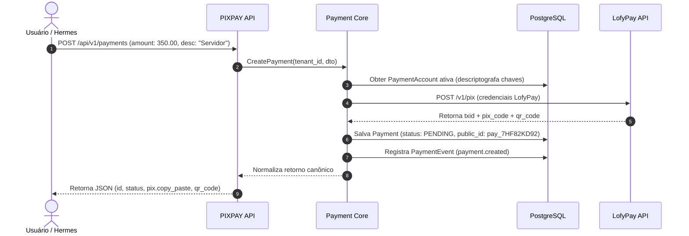

# PRD 002: Núcleo de Pagamentos PIX & Provider LofyPay

## 1. Contexto

- **Produto/área:** Motor Central de Pagamentos (`Payment Core`) e Adapter de Provedor Financeiro (`LofyPayProvider`).
- **Estado atual:** Nenhuma transação PIX é gerada na plataforma.
- **Problema:** O PIXPAY precisa gerar cobranças PIX dinâmicas utilizando as credenciais da LofyPay configuradas pelo tenant, expondo um contrato agnóstico de dados para que novas instituições financeiras possam ser adicionadas no futuro sem quebrar o frontend ou o Hermes Agent.

> **Contexto técnico:** O design de interfaces TypeScript, enums de status e criptografia AES-256-GCM para as chaves da LofyPay está registrado no TRD (`docs/trd.md`) e no ADR-002.

## 2. Solução Proposta

### Visão de produto
- Cadastro seguro da conta de pagamento (`PaymentAccount`) com credenciais da LofyPay (Sandbox / Produção).
- Botão "Testar Conexão" que valida as credenciais com o PSP antes de liberar a conta para uso.
- Geração de cobrança PIX com valor, descrição, cliente e tempo de expiração customizável.
- Retorno unificado contendo ID público não-sequencial (`pay_...`), código Copia e Cola, link do QR Code e timestamp de expiração.

### Decisões de produto
1. A LofyPay é o primeiro provedor suportado, mas o contrato público da API PIXPAY nunca expõe campos proprietários da LofyPay.
2. O identificador exposto externamente (`public_id`) deve ser aleatório e seguro (ex.: `pay_9xA2K8d1`), nunca o ID auto-incremental do banco de dados.
3. Tempo de expiração padrão de 30 minutos (1800 segundos) quando não especificado.
4. O valor do pagamento deve ser validado no backend (valor mínimo de R$ 0,50 e máximo configurável por tenant).

### Fora do escopo
- Split de pagamentos e repasse financeiro automático.
- Geração de cobranças parceladas ou recorrentes.

## 3. Funcionalidades

### US01: Conexão e Validação da Conta LofyPay
Como administrador do tenant, quero cadastrar minhas credenciais da LofyPay (Client ID e Secret Key), para que o PIXPAY possa gerar cobranças na minha conta bancária.

**Rules:**
- A Secret Key é recebida exclusivamente via HTTPS e criptografada com AES-256-GCM antes de ser salva no banco.
- Na interface, a chave deve ser mascarada exibindo apenas os 4 últimos caracteres (ex.: `sk_live_...93ab`).
- O sistema deve validar a autenticidade das credenciais executando uma chamada de verificação contra a API da LofyPay (`validateCredentials`).

**Edge cases:**
- Credenciais inválidas ou expiradas na LofyPay → Marcar conta como `INVALID` e exibir erro claro "Credenciais rejeitadas pelo provedor".
- Instabilidade de rede no momento do teste → Retornar erro "Não foi possível contatar o provedor LofyPay no momento; tente novamente em instantes".

### US02: Emissão de Cobrança PIX Dinâmica
Como usuário ou operador do tenant, quero gerar um PIX informando o valor e a descrição, para enviar ao meu cliente.

**Rules:**
- Campos obrigatórios: `amount` (maior que zero). Campos opcionais: `description`, `customer`, `expires_in`.
- O sistema delega a criação para o `PaymentProvider` ativo do tenant.
- A cobrança nasce com status canônico `PENDING` e gera um evento interno `payment.created`.
- A resposta contém o código Copia e Cola (`pix_copy_paste`) e a representação do QR Code em Base64/SVG.

**Edge cases:**
- Tenant sem conta de pagamento ativa conectada → Bloquear criação com erro HTTP 422: "Nenhuma conta de pagamento ativa configurada para este tenant".
- Falha na API do provedor (timeout ou 5xx) → Retornar erro HTTP 502: "Falha na comunicação com o provedor financeiro. Nenhuma cobrança foi gerada".

## 4. Fluxo de Negócio

## 5. Critérios de Aceite

### 5a. Critérios de aceite da feature
| Critério | Razão de negócio | Como verificar (observável) |
|---|---|---|
| Latência de criação | Evitar demora para o cliente no balcão ou chat | Criação completa de PIX (chamando sandbox LofyPay) em < 800ms (p95). |
| Isolamento de segredos | Prevenir vazamento de chaves bancárias | Inspecionar logs da API durante criação de cobrança; as chaves secretas nunca devem constar no payload de log. |
| ID público seguro | Evitar enumeração sequencial de faturamento | O identificador do pagamento retornado é no formato `pay_[0-9a-zA-Z]{12}`. |

### 5b. Métricas de sucesso
| Métrica | Baseline | Meta | Prazo | Mín. aceitável | Responsável |
|---|---|---|---|---|---|
| Taxa de sucesso na geração de PIX | N/A | > 99.5% | 30 dias após lançamento | 98% | Squad Backend |

## 6. Milestones

### Milestone 1: Abstração do Provedor e Mock Provider
**Por que é um marco:** Permite desenvolver e testar todo o fluxo de ponta a ponta sem depender de chaves reais de produção.
**Funcionalidades:** US01, US02
**Checklist de aceite:**
- [ ] Interface `PaymentProvider` definida em `packages/payment-core`.
- [ ] Implementação de `MockPaymentProvider` com geração simulada de QR Code e Copia e Cola.
- [ ] Testes unitários com cobertura > 85% para a camada de serviço de pagamentos.

### Milestone 2: Adapter LofyPay e Criptografia
**Por que é um marco:** Habilita transações financeiras reais com a conta da LofyPay.
**Funcionalidades:** US01, US02
**Checklist de aceite:**
- [ ] Chaves de API armazenadas de forma cifrada (AES-256-GCM) em `payment_accounts`.
- [ ] Implementação do `LofyPayProvider` comunicando com os endpoints oficiais da LofyPay.
- [ ] Validação de credenciais e geração de PIX funcional em ambiente Sandbox.

## 7. Riscos e Dependências

| Risco | Impacto | Mitigação | Status |
|---|---|---|---|
| Mudança de contrato na API da LofyPay | Alto | Camada `LofyPayProvider` isolada; mudanças afetam apenas um arquivo adapter sem alterar regras de negócio. | Mitigado |
| Chave mestra de criptografia perdida | Crítico | Variável `ENCRYPTION_KEY` documentada no cofre de senhas de infraestrutura e com backup seguro. | Monitorando |

## 8. Referências
- [PIXPAY Documento Mestre - Seções 8, 9, 10, 11 e 17](docs/PIXPAY_DOCUMENTO_MESTRE.md)
- [ADR-002: Payment Provider Abstraction](docs/adrs/002-payment-provider-abstraction.md)

## 9. Registro de Decisões
- **2026-09-20:** Adoção de `public_id` com prefixo `pay_` e hash criptográfico nano/cuid. Motivo: Impede scraping, ataque de enumeração de receitas e confusão com chaves internas de banco de dados.
