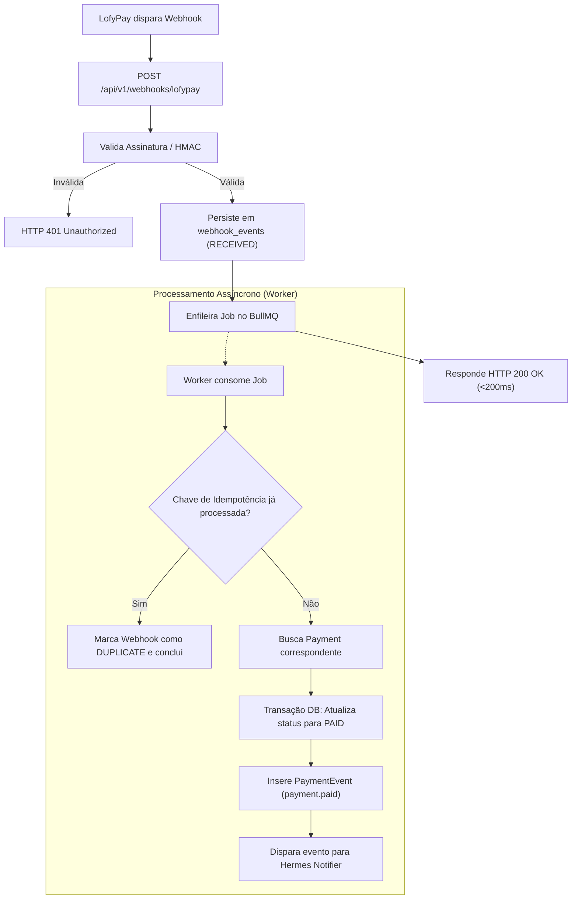

# PRD 003: Ingestão de Webhooks, Filas e Reconciliação Assíncrona

## 1. Contexto

- **Produto/área:** Ingestão de Notificações Financeiras, Processamento em Segundo Plano (`BullMQ Worker`) e Reconciliação de Pagamentos.
- **Estado atual:** A aplicação só cria pagamentos, mas não sabe quando eles são liquidados pelos pagadores.
- **Problema:** Provedores de PIX comunicam pagamentos através de webhooks HTTP. Esses webhooks podem sofrer atrasos, reenvios duplicados, desordem de chegada ou falhas de rede. A aplicação deve absorver esses eventos em milissegundos sem perder dados nem duplicar saldos ou notificações.

> **Contexto técnico:** Arquitetura de filas BullMQ, Redis, workers separados e locking distribuído documentada no TRD (`docs/trd.md`) e no ADR-007.

## 2. Solução Proposta

### Visão de produto
- Endpoint rápido de ingestão de webhooks (`POST /api/v1/webhooks/lofypay`).
- Gravação imediata do payload bruto em `webhook_events` antes de qualquer processamento pesado.
- Fila de processamento assíncrono para atualizar o pagamento para o status `PAID`, registrar o evento `payment.paid` e disparar notificações.
- Mecanismo rigoroso de idempotência financeira para descartar reenvios da LofyPay.
- Job periódico de reconciliação para consultar pagamentos `PENDING` próximos da expiração e verificar se caíram na LofyPay sem que o webhook tenha chegado.

### Decisões de produto
1. O endpoint HTTP do webhook deve sempre responder HTTP 200/202 em menos de 200ms para evitar que o PSP classifique o webhook como falho e suspenda os envios.
2. Todo pagamento confirmado atualiza o campo `paid_at` com o timestamp real informado pelo PSP.
3. Se um webhook chegar fora de ordem (ex.: evento de reembolso antes do evento de pagamento), o sistema deve ordenar pelo timestamp do PSP e registrar auditoria.

### Fora do escopo
- Webhooks de saída para terceiros (disponibilizado na Fase 8).

## 3. Funcionalidades

### US01: Ingestão de Webhooks com Idempotência
Como sistema PIXPAY, quero receber notificações de pagamento da LofyPay via webhook, para confirmar que o cliente efetuou o pagamento do PIX.

**Rules:**
- O payload bruto e os headers HTTP de assinatura são persistidos em `webhook_events` com status `RECEIVED`.
- O webhook é validado por assinatura/HMAC ou token compartilhado configurado no tenant.
- A chave de idempotência é construída com `provider + provider_transaction_id + event_type`.
- Se o evento já foi processado com sucesso, o sistema ignora o processamento repetido mas responde HTTP 200 com a mensagem "Evento já processado".

**Edge cases:**
- Webhook com assinatura inválida → Responder HTTP 401 Unauthorized e salvar tentativa com status `INVALID_SIGNATURE`.
- Webhook referente a pagamento inexistente na base → Salvar em `webhook_events` com status `UNMATCHED_PAYMENT` e emitir alerta para investigação.

### US02: Processamento Assíncrono e Reconciliação
Como operador ou sócio do tenant, quero que a confirmação de pagamento seja refletida no sistema mesmo se o webhook atrasar ou a rede oscilar.

**Rules:**
- O BullMQ Worker consome da fila `webhook-processing` com política de retry com backoff exponencial (3 tentativas).
- Ao confirmar o pagamento, atualiza `payments.status = PAID` e insere registro imutável em `payment_events`.
- A rotina de reconciliação roda a cada 5 minutos procurando pagamentos `PENDING` criados há mais de 2 minutos e consulta a API da LofyPay diretamente.

**Edge cases:**
- Pagamento expirado no PIXPAY mas pago na LofyPay → A reconciliação atualiza para `PAID` e registra evento de conciliação tardia `payment.reconciled_late`.
- Queda do Redis durante enfileiramento → O endpoint de webhook faz fallback de persistência no PostgreSQL para que nenhum dado seja perdido.

## 4. Fluxo de Negócio

## 5. Critérios de Aceite

### 5a. Critérios de aceite da feature
| Critério | Razão de negócio | Como verificar (observável) |
|---|---|---|
| Tempo de resposta da ingestão | Evitar cancelamento de envio pelo PSP | Endpoint de webhook responde em < 200ms sob carga de 20 req/s. |
| Garantia de idempotência | Prevenir duplicação de saldo ou notificação | Enviar o mesmo payload de webhook 5 vezes consecutivas; apenas 1 registro de `payment.paid` é gerado e o status permanece `PAID`. |
| Reconciliação automática | Não depender unicamente de entrega de webhook | Simular falha na entrega do webhook; a rotina periódica deve consultar o PSP e atualizar o pagamento para `PAID` em até 5 minutos. |

### 5b. Métricas de sucesso
| Métrica | Baseline | Meta | Prazo | Mín. aceitável | Responsável |
|---|---|---|---|---|---|
| Taxa de perda de eventos financeiros | 0 | 0.00% (Zero perda) | Contínuo | 0.00% | Squad Backend / Infra |

## 6. Milestones

### Milestone 1: Ingestão de Webhook e Persistência Bruta
**Por que é um marco:** Garante que todo evento emitido pelo PSP seja registrado de forma indelével.
**Funcionalidades:** US01
**Checklist de aceite:**
- [ ] Tabela `webhook_events` criada e indexada no PostgreSQL.
- [ ] Endpoint de ingestão recebendo e salvando requisições com latência < 200ms.

### Milestone 2: Worker BullMQ e Reconciliação Periódica
**Por que é um marco:** Fecha o ciclo automático de confirmação financeira sem intervenção manual.
**Funcionalidades:** US02
**Checklist de aceite:**
- [ ] BullMQ Worker processando transições de estado para `PAID` com locks distribuídos.
- [ ] Job de reconciliação ativo via cron/scheduler verificando pendências com o provider.

## 7. Riscos e Dependências

| Risco | Impacto | Mitigação | Status |
|---|---|---|---|
| Sobrecarga de memória do Redis com jobs acumulados | Médio | Limite de retenção de jobs concluídos (máx 1000 jobs ou 24 horas); política `allkeys-lru` ativada. | Mitigado |

## 8. Referências
- [PIXPAY Documento Mestre - Seções 13, 14, 15, 34 e 35](docs/PIXPAY_DOCUMENTO_MESTRE.md)
- [ADR-007: Asynchronous Queue Processing](docs/adrs/007-asynchronous-queue-processing.md)

## 9. Registro de Decisões
- **2026-09-20:** Persistência síncrona do webhook bruto em PostgreSQL antes da resposta HTTP, com delegação do processamento de negócio para o Redis/Worker. Motivo: Se o Redis reiniciar no exato segundo do envio, o webhook nunca é perdido.
