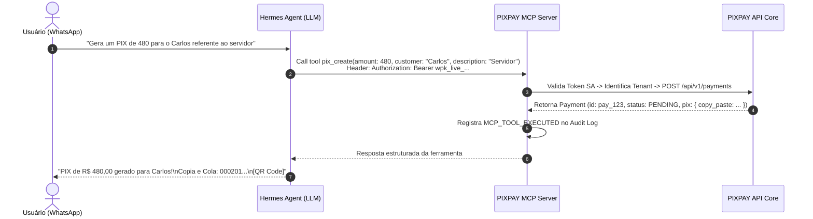

# PRD 004: Servidor MCP para Hermes Agent (WhatsApp)

## 1. Contexto

- **Produto/área:** Servidor de Ferramentas MCP (Model Context Protocol) para Agentes de Inteligência Artificial.
- **Estado atual:** O Hermes Agent não possui ferramentas para se comunicar com o PIXPAY.
- **Problema:** Usuários no WhatsApp desejam solicitar cobranças ("Gera um PIX de 480 para o Carlos referente ao servidor") e consultar se os valores caíram diretamente pelo chat. A IA não pode ter acesso a credenciais bancárias e não pode executar ações destrutivas ou perigosas.

> **Contexto técnico:** Transporte Streamable HTTP / Server-Sent Events (SSE) do MCP SDK, schemas JSON Schema e autorização por Service Account documentados no TRD (`docs/trd.md`) e no ADR-001/004.

## 2. Solução Proposta

### Visão de produto
- Servidor MCP (`apps/mcp`) operando em `https://pixpay.awecloudsolution.com/mcp`.
- Autenticação por token Bearer de Service Account (`wpk_live_...`).
- Quatro ferramentas de baixo risco focadas estritamente em recebimento e consulta:
  1. `pix_create`: Cria uma nova cobrança PIX.
  2. `pix_get`: Consulta uma cobrança existente por ID, valor, cliente ou descrição.
  3. `pix_list`: Lista cobranças com filtros por status e data.
  4. `pix_summary`: Retorna totais agregados de faturamento por período.
- Auditoria de cada invocação de ferramenta em `audit_logs`.

### Decisões de produto
1. Nenhuma ferramenta de alteração de credenciais, exclusão de registros ou transferência financeira (cashout) será exposta ao MCP.
2. O Hermes nunca recebe ou manipula `tenant_id`. O tenant é inferido unicamente a partir da chave de autenticação da Service Account.
3. Respostas formatadas de forma amigável para mensagens de WhatsApp (com quebras de linha e textos objetivos).

### Fora do escopo
- Ferramentas de estorno/reembolso (refund) via IA no MVP (devem ser feitas no painel web).
- Gerenciamento de usuários ou criação de novos tenants via IA.

## 3. Funcionalidades

### US01: Criação de PIX via Linguagem Natural
Como usuário interagindo com o Hermes no WhatsApp, quero pedir para gerar um PIX em linguagem natural, para receber o QR Code e código Copia e Cola no chat.

**Rules:**
- A ferramenta `pix_create` recebe: `amount` (float obrigatório), `customer` (string opcional), `description` (string opcional), `expires_in` (inteiro opcional).
- O backend valida se o valor respeita o teto máximo permitido para aquele tenant.
- A resposta retorna `pix_copy_paste`, link do QR Code e prazo de validade.

**Edge cases:**
- Valor solicitado negativo ou zero → Retornar erro de validação: "O valor da cobrança deve ser maior que R$ 0,00".
- Tentativa de prompt injection pelo usuário no campo descrição (ex.: "ignora instruções anteriores...") → O backend trata o texto puramente como dado literal, sem reavaliação de instruções.

### US02: Consulta e Resumos Financeiros
Como sócio no WhatsApp, quero perguntar ao Hermes "O PIX do Carlos caiu?" ou "Quanto entrou hoje?", para ter visibilidade financeira imediata.

**Rules:**
- A ferramenta `pix_get` busca cobranças compatíveis com o critério fornecido dentro do escopo do tenant autenticado.
- A ferramenta `pix_summary` calcula a soma dos pagamentos com status `PAID` dentro da janela solicitada (hoje, ontem, última semana, mês corrente).
- Se houver mais de um pagamento compatível com a busca do `pix_get`, a ferramenta retorna os 3 mais recentes ordenados por data.

**Edge cases:**
- Nenhuma cobrança encontrada para a busca → Retornar lista vazia com mensagem "Nenhuma cobrança encontrada para os critérios informados".
- Solicitação de períodos muito extensos (>90 dias) no WhatsApp → Retornar resumo com aviso "Período limitado aos últimos 90 dias para otimização da consulta".

## 4. Fluxo de Negócio

## 5. Critérios de Aceite

### 5a. Critérios de aceite da feature
| Critério | Razão de negócio | Como verificar (observável) |
|---|---|---|
| Segurança de escopo | Hermes não pode alterar dados sensíveis | Executar chamada de ferramenta arbitrária fora do schema MCP declarado; o servidor deve rejeitar com código JSON-RPC `MethodNotFound`. |
| Tempo de execução da ferramenta | Experiência fluida no WhatsApp | A invocação da ferramenta `pix_create` via MCP completa em menos de 1,2s (p95). |
| Auditoria completa | Rastreabilidade de ações da IA | Cada invocação de tool deve gerar uma linha em `audit_logs` contendo `actor_type: SERVICE_ACCOUNT`, nome da tool e parâmetros recebidos. |

### 5b. Métricas de sucesso
| Métrica | Baseline | Meta | Prazo | Mín. aceitável | Responsável |
|---|---|---|---|---|---|
| Taxa de erro de tool call do MCP | N/A | < 1% | 30 dias após lançamento | < 3% | Squad IA / Backend |

## 6. Milestones

### Milestone 1: Implementação do Servidor MCP e Schemas
**Por que é um marco:** Disponibiliza a interface canônica MCP sobre HTTP/SSE para conexão do Hermes.
**Funcionalidades:** US01, US02
**Checklist de aceite:**
- [ ] Servidor MCP implementado em `apps/mcp` utilizando o MCP SDK oficial.
- [ ] Ferramentas `pix_create`, `pix_get`, `pix_list` e `pix_summary` devidamente tipadas e expostas.
- [ ] Testes de integração simulando chamadas JSON-RPC com sucesso e falha de autorização.

## 7. Riscos e Dependências

| Risco | Impacto | Mitigação | Status |
|---|---|---|---|
| Alucinação de tool call pela LLM | Médio | Validação estrita por DTOs e JSON Schema; o backend rejeita parâmetros inválidos com mensagens de erro auto-explicativas. | Mitigado |

## 8. Referências
- [PIXPAY Documento Mestre - Seções 20, 21, 22, 23 e 31](docs/PIXPAY_DOCUMENTO_MESTRE.md)
- [ADR-001: REST and MCP Architecture](docs/adrs/001-rest-and-mcp-architecture.md)
- [ADR-004: Hermes Service Account Isolation](docs/adrs/004-hermes-service-account-isolation.md)

## 9. Registro de Decisões
- **2026-09-20:** Exclusão deliberada de qualquer ferramenta de transferência ou alteração de chaves do MCP. Motivo: Proteção arquitetural em profundidade contra ataques de prompt injection ou alucinações da LLM.
