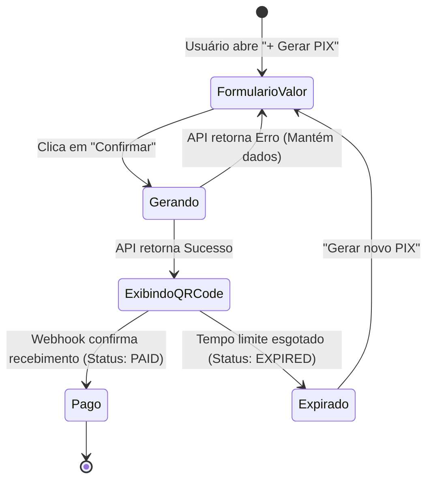

# PRD 005: Painel Web Minimalista & Dashboard

## 1. Contexto

- **Produto/área:** Frontend Web Operacional do PIXPAY (`apps/web`).
- **Estado atual:** O projeto não possui interface visual construída.
- **Problema:** A maioria dos sistemas bancários e gateways de pagamento exige múltiplos cliques, telas lentas e fluxos burocráticos para gerar um simples PIX. O PIXPAY necessita de um painel web que elimine ruídos, operando como uma "calculadora de cobrança" de carregamento instantâneo.

> **Contexto técnico:** Next.js (App Router / React / TypeScript), Tailwind CSS, baseline de design e checklists corporativos da Wittemberg documentados no TRD (`docs/trd.md`) e em `.harness/standards/wittemberg/`.

## 2. Solução Proposta

### Visão de produto
- Painel minimalista e ultra-responsivo (desktop, tablet e mobile).
- Dashboard inicial direto ao ponto:
  - Total recebido hoje (R$).
  - Quantidade de pagamentos hoje.
  - Total pendente (R$).
  - Botão de destaque imediato: `+ Gerar PIX`.
- Modal/página de emissão rápida com 1 campo obrigatório (`Valor`) e campos opcionais em acordeão/recolhíveis (`Descrição`, `Cliente`, `Expiração`).
- Tela de apresentação da cobrança com botão "Copiar Código PIX", visualização nítida do QR Code e polling suave de atualização de status.

### Decisões de produto
1. Respeito rigoroso à Baseline Wittemberg: zoom 100% de referência, nenhum componente extrapola container, zero falhas silenciosas.
2. Não replicar gráficos pesados ou relatórios contábeis complexos no MVP; priorizar a velocidade de emissão.
3. Tela de credenciais LofyPay protegida: campo de Secret Key com máscara e botão "Testar Conexão".

### Fora do escopo
- Edição de tema visual ou customização de cores da marca no MVP.
- Exportação avançada em formatos contábeis (OFX, SPED, etc.).

## 3. Funcionalidades

### US01: Emissão Rápida de PIX na Web
Como usuário autenticado, quero digitar o valor e gerar o PIX em um clique, para apresentar o QR Code na tela ou copiar o código.

**Rules:**
- O cursor deve focar automaticamente no campo `Valor` ao abrir o modal/tela.
- O botão `Gerar PIX` aciona a API e desabilita a si mesmo com indicador visual de progresso para evitar cliques múltiplos.
- Ao retornar o código, o botão `Copiar` fornece feedback tátil e visual ("Copiado com sucesso!").
- A tela monitora o status do pagamento via polling suave (intervalo de 3 segundos) ou WebSocket e exibe confirmação animada quando o status mudar para `PAID`.

**Edge cases:**
- Falha na conexão de rede durante a geração → Exibir banner vermelho informativo com opção "Tentar novamente", sem perder os dados já digitados no formulário.
- Pagamento expira na tela → O QR Code fica acinzentado e exibe o badge `EXPIRADO`, com botão "Gerar novo PIX".

### US02: Histórico e Acompanhamento de Recebimentos
Como operador, quero visualizar a listagem das cobranças recentes, para identificar quais já foram pagas e quais estão vencidas.

**Rules:**
- Tabela paginada (10 ou 20 registros por página) com badges visuais de status:
  - `PAID`: Verde
  - `PENDING`: Amarelo
  - `EXPIRED`: Cinza
  - `FAILED`: Vermelho
- Filtros rápidos por período (Hoje, Ontem, Últimos 7 dias) e campo de busca textual por cliente ou ID.

**Edge cases:**
- Nenhum registro encontrado para os filtros → Exibir Empty State explicativo com ilustração sutil e botão para limpar os filtros.

## 4. Fluxo de Negócio

## 5. Critérios de Aceite

### 5a. Critérios de aceite da feature
| Critério | Razão de negócio | Como verificar (observável) |
|---|---|---|
| Tempo até geração de PIX | Fricção zero na cobrança presencial | Da digitação do valor até a exibição do QR Code na tela em menos de 1,5s em conexão padrão. |
| Responsividade e contenção | Padrão Wittemberg | Testar em viewport 375px (mobile) e 1920px (desktop); nenhum texto ou botão quebra ou cria barra de rolagem horizontal desnecessária. |
| Feedback de cópia | Confiança operacional | Clicar em "Copiar código" deve alterar o texto do botão para "Copiado!" por 2 segundos e colocar o texto na área de transferência. |

### 5b. Métricas de sucesso
| Métrica | Baseline | Meta | Prazo | Mín. aceitável | Responsável |
|---|---|---|---|---|---|
| Tempo médio de geração de PIX | N/A | < 10 segundos (fluxo completo) | 30 dias após lançamento | < 20s | Squad Frontend |

## 6. Milestones

### Milestone 1: Dashboard e Formulário de Geração
**Por que é um marco:** Entrega o fluxo principal da aplicação web para uso diário pelos sócios.
**Funcionalidades:** US01
**Checklist de aceite:**
- [ ] Telas de Login, Dashboard e Modal de Geração de PIX implementadas em Next.js.
- [ ] Cópia para área de transferência e renderização do QR Code SVG/Canvas.
- [ ] Verificação de zoom 100% e responsividade mobile.

### Milestone 2: Histórico e Configuração LofyPay
**Por que é um marco:** Completa o ciclo de gestão financeira e configuração de credenciais no frontend.
**Funcionalidades:** US02
**Checklist de aceite:**
- [ ] Tabela de histórico de pagamentos com paginação e filtros.
- [ ] Tela de configuração de credenciais com máscara de segurança e teste de conexão com a LofyPay.

## 7. Riscos e Dependências

| Risco | Impacto | Mitigação | Status |
|---|---|---|---|
| Bloqueio de clipboard em navegadores sem HTTPS | Baixo | HTTPS é obrigatório em toda a infraestrutura com certificado Let's Encrypt ativo. | Mitigado |

## 8. Referências
- [PIXPAY Documento Mestre - Seções 18 e 19](docs/PIXPAY_DOCUMENTO_MESTRE.md)
- [Baseline de Desenvolvimento Wittemberg](.harness/standards/wittemberg/README.md)

## 9. Registro de Decisões
- **2026-09-20:** Foco total na velocidade de geração em tela única ("calculadora de PIX"). Motivo: O valor do produto está na velocidade de cobrança, não em relatórios extensos.
